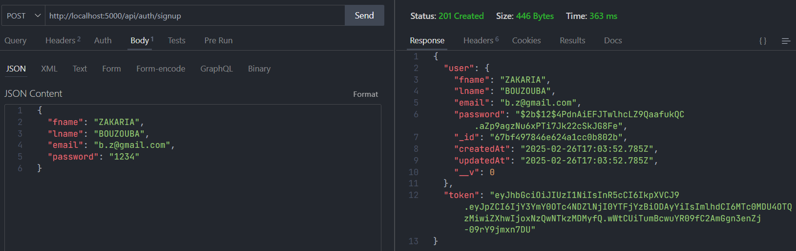
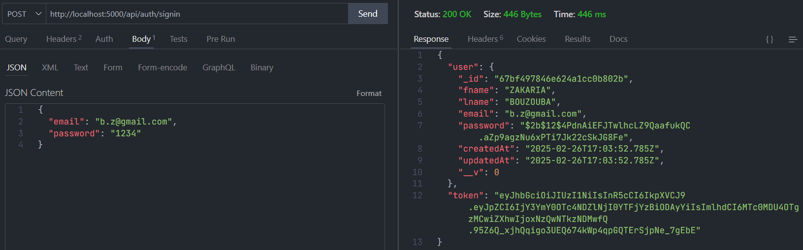
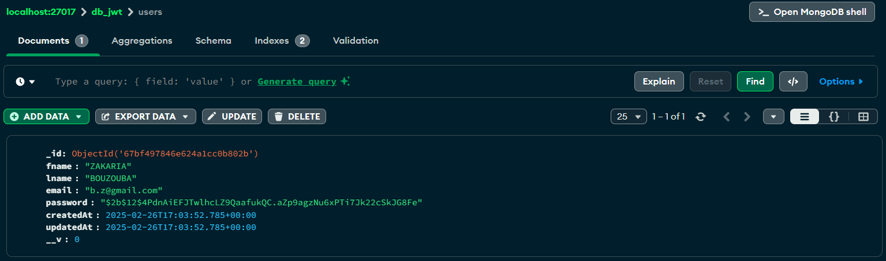

# **Backend Authentication API**

Ce projet est une API d'authentification utilisant **Node.js, Express, MongoDB et JWT**. Il inclut l'inscription et la connexion des utilisateurs avec un mot de passe sécurisé via **bcrypt**.

---

## 🛠️ Technologies utilisées

- **Node.js**
- **Express.js**
- **MongoDB (Mongoose)**
- **JWT (JSON Web Token)**
- **dotenv**
- **bcrypt**

---

## 📂 Structure du projet

```
📦 backend
┣ 📂 controllers
┃ ┗ 📜 login_controller.js
┣ 📂 models
┃ ┗ 📜 user_model.js
┣ 📂 routes
┃ ┗ 📜 login_routes.js
┣ 📜 index.js
┣ 📜 .env
┣ 📜 package.json
```

---

## 🚀 Installation et exécution

### 1️⃣ Cloner le projet

```sh
git clone https://github.com/zakaria-bouzouba/tp1-jwt.git
cd backend
```

### 2️⃣ Installer les dépendances

```sh
npm install
```

### 3️⃣ Configurer les variables d'environnement

Créer un fichier `.env` à la racine du projet et y ajouter :

```env
DB_URI="mongodb://localhost:27017/db_jwt"
SERVER_PORT=5000
JWT_SECRET="mysecretkey"
```

### 4️⃣ Démarrer le serveur

```sh
npm start
```

Le serveur sera accessible sur **http://localhost:5000**

---

## 🔥 Endpoints API

### 1️⃣ Inscription (**POST** `/api/auth/signup`)

**Description :** Crée un nouvel utilisateur.

📩 **Body JSON :**

```json
{
  "fname": "John",
  "lname": "Doe",
  "email": "johndoe@example.com",
  "password": "securepassword"
}
```

📤 **Réponse (201) :**

```json
{
  "user": {
    "_id": "65123abc...",
    "fname": "John",
    "lname": "Doe",
    "email": "johndoe@example.com"
  },
  "token": "jwt_token_here"
}
```

---

### 2️⃣ Connexion (**POST** `/api/auth/signin`)

**Description :** Authentifie un utilisateur existant.

📩 **Body JSON :**

```json
{
  "email": "johndoe@example.com",
  "password": "securepassword"
}
```

📤 **Réponse (200) :**

```json
{
  "user": {
    "_id": "65123abc...",
    "fname": "John",
    "lname": "Doe",
    "email": "johndoe@example.com"
  },
  "token": "jwt_token_here"
}
```

---

## 📌 Tests avec Thunder Client

Nous avons testé l'API avec **Thunder Client**. Voici des captures d'écran des tests :

✅ **Test Inscription**


✅ **Test Connexion**


✅ **MongoDB Compass**


---

## **🗝 Les fichiers clés**

### 📜 `login_controller.js`

```javascript
import bcrypt from "bcrypt";
import jwt from "jsonwebtoken";
import UserModel from "../models/user_model.js";

export async function signUp(req, res) {
  const { fname, lname, email, password } = req.body;
  try {
    const existingUser = await UserModel.findOne({ email });
    if (existingUser) {
      return res.status(400).json({ message: "L'utilisateur existe déjà" });
    }
    const salt = await bcrypt.genSalt(12);
    const hashedPassword = await bcrypt.hash(password, salt);
    const newUser = await UserModel.create({
      fname,
      lname,
      email,
      password: hashedPassword,
    });
    const token = jwt.sign({ id: newUser._id }, process.env.JWT_SECRET, {
      expiresIn: "1h",
    });
    res.status(201).json({ user: newUser, token });
  } catch (error) {
    res.status(500).json({ message: "Quelque chose s'est mal passé" });
  }
}

export async function signIn(req, res) {
  const { email, password } = req.body;
  try {
    const user = await UserModel.findOne({ email });
    if (!user) {
      return res.status(404).json({ message: "Utilisateur non trouvé" });
    }
    const isPasswordCorrect = await bcrypt.compare(password, user.password);
    if (!isPasswordCorrect) {
      return res.status(400).json({ message: "Identifiants invalides" });
    }
    const token = jwt.sign({ id: user._id }, process.env.JWT_SECRET, {
      expiresIn: "1h",
    });
    res.status(200).json({ user, token });
  } catch (error) {
    res.status(500).json({ message: "Quelque chose s'est mal passé" });
  }
}
```

### 📜 `user_model.js`

```javascript
import mongoose from "mongoose";

const userSchema = new mongoose.Schema(
  {
    fname: { type: String, required: true },
    lname: { type: String, required: true },
    email: { type: String, required: true, unique: true },
    password: { type: String, required: true },
  },
  { timestamps: true }
);

const UserModel = mongoose.model("User", userSchema);
export default UserModel;
```

### 📜 `login_routes.js`

```javascript
import express from "express";
import { signUp, signIn } from "../controllers/login_controller.js";

const router = express.Router();
router.route("/signup").post(signUp);
router.route("/signin").post(signIn);
export default router;
```

### 📜 `index.js`

```javascript
import express from "express";
import mongoose from "mongoose";
import dotenv from "dotenv";
import loginRouter from "./routes/login_routes.js";

const app = express();
dotenv.config();
app.use(express.json());
app.use("/api/auth", loginRouter);

mongoose
  .connect(process.env.DB_URI)
  .then(() => {
    app.listen(process.env.SERVER_PORT, () => {
      console.log(`Serveur démarré sur le port ${process.env.SERVER_PORT}`);
    });
  })
  .catch((error) => {
    console.log("Connexion à la base de données échouée!", error.message);
  });
```

---

📌 **Développé par ZAKARIA BOUZOUBA** 🚀
